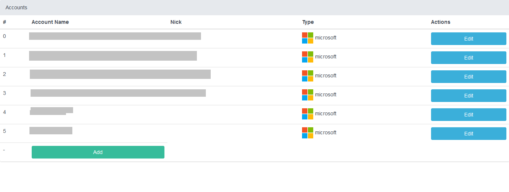
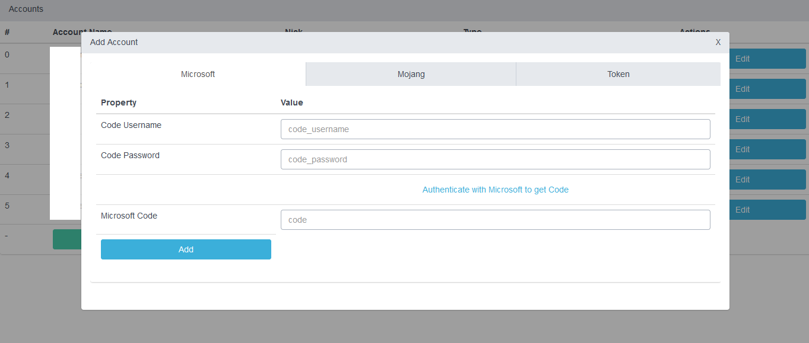

# Minecraft Authserver
A server for proxying your Minecraft accounts simulating mojang auth server responses. Supports authentication and token refreshing.
It's based on [minecraft-auth](https://github.com/dommilosz/minecraft-auth) package

There is web ui at endpoint /

It supports Mojang, Microsoft and Token based accounts. 
Cracked accounts have no point to be added.

### Demo of web UI
Main panel:


Account creator:


Account editor:


### Example config
fileLocation can be `local` or firebase realtime database url.
password is `root` by default. You must change it in order to access the web ui.
ms.appID, ms.appSecret are your [azure app credentials](https://github.com/dommilosz/minecraft-auth/issues/8). 
```
{
  "port": 8080,
  "rateLimits": {
    "window": 900,
    "limit": 30
  },
  "fileLocation": "local", 
  "password": "root",
  "ms": {
    "appID": "",
    "appSecret": "",
    "redirectUrl": "https://httpbin.org/get"
  }
}
```