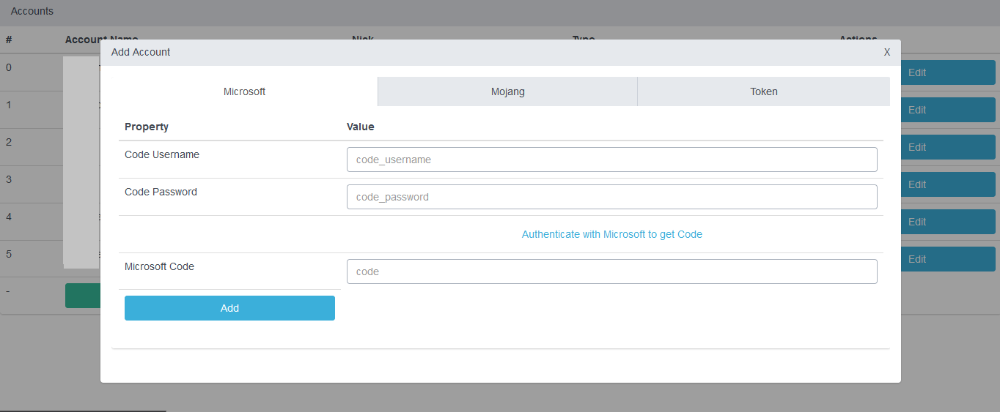
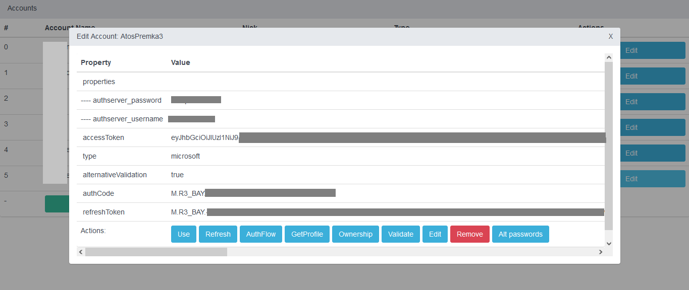

# Minecraft Authserver
A server for proxying your Minecraft accounts simulating mojang auth server responses. Supports authentication and token refreshing.
It's based on [minecraft-auth](https://github.com/dommilosz/minecraft-auth) package

There is web ui at endpoint /

It supports Mojang, Microsoft and Token based accounts. 
Cracked accounts have no point to be added.

Web UI is protected by basic http auth. Username is admin and password is set in config. Default `root` password cannot be used.  

Files can be stored locally or in firebase realtime database. If you want to use rtdb place firebase-secrets.json in root directory and in fileLocation in config enter your rtdb url.

### Demo of web UI
Main panel:


Account creator:


Account editor:


### Example config
fileLocation can be `local` or firebase realtime database url.
password is `root` by default. You must change it in order to access the web ui.
ms.appID, ms.appSecret are your [azure app credentials](https://github.com/dommilosz/minecraft-auth/issues/8). 
```
{
  "port": 8080,
  "rateLimits": {
    "window": 900,
    "limit": 30
  },
  "fileLocation": "local", 
  "password": "root",
  "ms": {
    "appID": "",
    "appSecret": "",
    "redirectUrl": "https://httpbin.org/get"
  }
}
```
